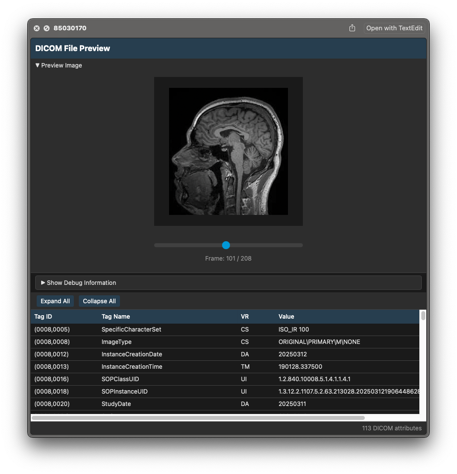

# DICOM QuickLook Preview

A macOS QuickLook extension for previewing DICOM (Digital Imaging and Communications in Medicine) files directly in Finder. This application uses Rust for fast and efficient DICOM parsing, displaying the DICOM attributes in a well-formatted table and a preview image if the file contains PixelData. This tool is meant to assist with introspecting DICOM files on disk for engineering and R&D usage.

⚠️ WARNING: This preview tool is not intended for clinical use! ⚠️

The images reproduced in the preview may not render like they would in software conforming to the full DICOM specification!




## Features

- 🔍 Quick preview of DICOM files using spacebar in Finder
- 📊 View all DICOM attributes in a clean, organized table format
- ⚡️ Fast performance with Rust-based parsing via dicom-rs
- 🎯 Support for standard DICOM file formats
- 🔒 Privacy-focused: all processing done locally on your machine

## Requirements

- macOS 14.0 or later
- Xcode 14.0 or later (for development)
- Rust toolchain (for development)

## Installation

### From Release
1. Download the latest release from the [Releases page](https://github.com/neuralinkcorp/DicomPreview/releases)
2. Move DicomPreview.app to your Applications folder
3. Double-click to open (you may need to right-click and select "Open" the first time due to macOS security)
4. The QuickLook extension will be automatically registered

### Building from Source

1. Clone the repository:
   ```bash
   git clone https://github.com/neuralinkcorp/DicomPreview.git
   cd DicomPreview
   ```

2. Install Rust if you haven't already:
   ```bash
   curl --proto '=https' --tlsv1.2 -sSf https://sh.rustup.rs | sh
   ```

3. Build the project:
   ```bash
   # Build the Rust library
   ./build_rust_library.sh
   
   # Build the Xcode project
   xcodebuild -project DicomPreview.xcodeproj -scheme DicomPreview -configuration Release
   ```

4. The built application will be in `build/Release/DicomPreview.app`

## Usage

1. Install the application as described above
2. In Finder, select any DICOM file (common extensions: .dcm, .dicom, .dic)
3. Press spacebar to activate QuickLook
4. The preview will show a table with:
   - Tag ID
   - Element Name
   - Value Representation (VR)
   - Element Value

## Project Structure

```
DicomPreview/
├── DicomPreview/            # Main application code
├── DicomPreviewExtension/   # QuickLook extension
├── dicom-parser/           # Rust DICOM parsing library
│   ├── src/               # Rust source code
│   └── Cargo.toml         # Rust dependencies
└── build_rust_library.sh   # Build script for Rust library
```

## Development

### Contributing

See [CONTRIBUTING.md](CONTRIBUTING.md) for detailed information on how to contribute to this project, including development setup, pre-commit hooks, and workflow guidelines.

## Troubleshooting

### Common Issues

1. **Preview not showing**: Make sure the extension is enabled in System Preferences → Extensions → Quick Look
2. **Build errors**: Ensure you have the latest Xcode and Rust toolchain installed
3. **Performance issues**: Please report them with the DICOM file size and specifications

### qlmanage
The QuickLook Cache can be flushed with:
```sh
# Reset thumbnail disk cache
qlmanage -r cache

# Open QuickLook for a specific file
qlmanage -p $FILE
```

### Multiple versions
Check `System Information > Software > Applications` to see which apps are registered.

## License

This project is licensed under the BSD 3-Clause License - see the [LICENSE](LICENSE) file for details.

## Acknowledgments

- [dicom-rs](https://github.com/Enet4/dicom-rs) - Rust DICOM parsing library

## Support

For support, please:
1. Search existing [Issues](https://github.com/neuralinkcorp/DicomPreview/issues)
2. Open a new issue if needed
